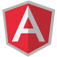
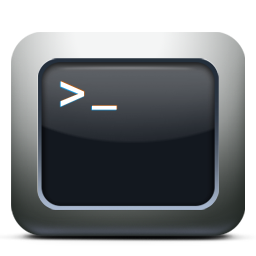



  <!-- Header -->
  <header>
      

          

              

                  
                  

                      DataSwarm
                      
 

                      A web-based notebook for big data
                  

              

          

      

  </header>
<!-- Portfolio Grid Section -->
  <section id="portfolio">
      

          

              

                  <h2>Features</h2>
                  

              

          

          

              

                  <a href="#feature1" class="portfolio-link" data-toggle="modal">
                      

                          

                              <i>Notebook</i>
                          

                      

                      
                  </a>
              

              

                  <a href="#feature2" class="portfolio-link" data-toggle="modal">
                      

                          

                              <i>Infraestructure</i>
                          

                      

                      
                  </a>
              

              

                  <a href="#feature3" class="portfolio-link" data-toggle="modal">
                      

                          

                              <i>Interpreters</i>
                          

                      

                      
                  </a>
              

              

                  <a href="#feature4" class="portfolio-link" data-toggle="modal">
                      

                          

                              <i>Versions Control</i>
                          

                      

                      
                  </a>
              

              

                  <a href="#feature5" class="portfolio-link" data-toggle="modal">
                      

                          

                              <i>Workflows</i>
                          

                      

                      
                  </a>
              

              

                  <a href="#feature6" class="portfolio-link" data-toggle="modal">
                      

                          

                              <i>Big Data Science Tool</i>
                          

                      

                      
                  </a>
              

          

      

  </section>

  <!-- About Section -->
  <section class="success" id="about">
      

          

              

                  <h2>About</h2>
                  

              

          

          

              

                  <h3>Team</h3>
                  
We are two: the boy of technology and the girl of data. Why not to put two things together? And think in big... BigData!

              

              

                  <h3>Business</h3>
                  
Dare to try DataSwarm!!! Write us :)

              

              

                  <a href="#" class="btn btn-lg btn-outline">
                      <i class="fa fa-download"></i> Download Theme
                  </a>
              

          

      

  </section>

  <!-- Contact Section -->
  <section id="contact">
      

          

              

                  <h2>Contact us</h2>
                  

              

          

          

              

                <form action="https://getsimpleform.com/messages?form_api_token=9be831dbaa768d762c67b4c07b3b3bfc" method="post">
                  

                    <label for="recipient-name" class="control-label">Name:</label>
                    <input type="text" name="name" class="form-control" id="recipient-name">
                  

                  

                    <label for="message-text" class="control-label">Message:</label>
                    <textarea class="form-control" id="message-text" name="message"></textarea>
                  

                  

                    <label class="control-label"></label>
                    

                      <button type="button" class="btn btn-default" data-dismiss="modal">Close</button>
                      <button type="submit" class="btn btn-success" >Send </button>
                    

                  
          
                </form>
              

          

      

  </section>

  <!-- Footer -->
  <footer class="text-center">
      

          

              

                  

                      <h3>Location</h3>
                      
Madrid Madrid Spain, CA 28053

                  

                  

                      <h3>Around the Web</h3>
                      <ul class="list-inline">
                          <li>
                              <a href="#" class="btn-social btn-outline"><i class="fa fa-fw fa-facebook"></i></a>
                          </li>
                          <li>
                              <a href="#" class="btn-social btn-outline"><i class="fa fa-fw fa-google-plus"></i></a>
                          </li>
                          <li>
                              <a href="#" class="btn-social btn-outline"><i class="fa fa-fw fa-twitter"></i></a>
                          </li>
                          <li>
                              <a href="#" class="btn-social btn-outline"><i class="fa fa-fw fa-linkedin"></i></a>
                          </li>
                          <li>
                              <a href="#" class="btn-social btn-outline"><i class="fa fa-fw fa-dribbble"></i></a>
                          </li>
                      </ul>
                  

                  

                      <h3>DataSwarm</h3>
                      
Be the change that you wish to see in the world

                  

              

          

      

      

          

              

                  

                      Copyright &copy; DataSwarm 2015
                  

              

          

      

  </footer>

  <!-- Scroll to Top Button (Only visible on small and extra-small screen sizes) -->
  

      <a class="btn btn-primary" href="#page-top">
          <i class="fa fa-chevron-up"></i>
      </a>
  

  <!-- Portfolio Modals -->
  

      

          

              

                  

                  

              

          

          

              

                  

                      

                          <h2>DataSwarm Notebook</h2>
                          

                          
This is a multipurpose area: allows data scientists to perform analysis and proof of concepts quickly. They can also share results and save them for reuse. It is based on <a target="_black" href="https://zeppelin.incubator.apache.org/">Zeppelin Notebook</a>.

                          
                          

                          <h3>Data visualization</h3>
                          

                            Some basic charts are already included in DataSwarm. Visualizations are not limited to SparkSQL's query, any output from any language backend can be recognized and visualized.
                          

                          
                          

                          

                            Notebooks can be shared, save versions using gist and can be set to excecute at specific time recursively. Also paragraphs included on notebooks can be published into external web pages.
                          

                          

                          <button type="button" class="btn btn-default" data-dismiss="modal"><i class="fa fa-times"></i> Close</button>
                      

                  

              

          

      

  

  

      

          

              

                  

                  

              

          

          

              

                  

                      

                          <h2>Infraestructure</h2>
                          

                          
DataSwarm allows the manipulation of infrastructure for massive data analysis. You can create, resize or remove clusters.

                          
                          

                          <button type="button" class="btn btn-default" data-dismiss="modal"><i class="fa fa-times"></i> Close</button>
                      

                  

              

          

      

  

  

      

          

              

                  

                  

              

          

          

              

                  

                      

                          <h2>Interpreters</h2>
                          

                          
DataSwarm offers the posibility of write code in diferent languages.

                          <!-- 

                            

                              
Apache Spark

                              
                            

                            

                              
Apache Hive

                              
                            

                            

                              
Redshift

                              
                            

                            

                              
Luigi

                              
                            

                            

                              
Scala

                              
                            

                            

                              
Angular

                              
                            

                            

                              
Shell

                              
                            

                            

                              
Infraestructure

                              
                            

                          
 -->
                          

        <ul style="list-style-type: none;padding-left:10px;" >
          <li style="font-size:20px; margin: 5px;"> Apache Spark</li>
          <li style="font-size:20px; margin: 5px;"> Apache Hive</li>
          <li style="font-size:20px; margin: 5px;"> Redshift</li>
          <li style="font-size:20px; margin: 5px;"> Luigi</li>
        </ul>
      

      

         
        <ul style="list-style-type: none;padding-left:10px;" >
          <li style="font-size:20px; margin: 5px;"> Scala</li>
          <li style="font-size:20px; margin: 5px;"> Angular</li>
          <li style="font-size:20px; margin: 5px;"> Shell</li>
          <li style="font-size:20px; margin: 5px;"> Comming more</li>
        </ul>
      
    
      

                          <ul class="list-inline item-details">
                              <li>Client:
                                  
                              </li>
                              <li>Date:
                                  
                              </li>
                              <li>Service:
                                  
                              </li>
                              <li>Client:
                                  
                              </li>
                              <li>Date:
                                  
                              </li>
                              <li>Service:
                                  
                              </li>
                              <li>Client:
                                  
                              </li>
                              <li>Date:
                                  
                              </li>
                          </ul>
                          

                          <button type="button" class="btn btn-default" data-dismiss="modal"><i class="fa fa-times"></i> Close</button>
                      

                  

              

          

      

  

  

      

          

              

                  

                  

              

          

          

              

                  

                      

                          <h2>Versions Control</h2>
                          

                          
Track your notebooks versions. Socialice (or not) your code, but has full control of it.

                          
                          

                          <button type="button" class="btn btn-default" data-dismiss="modal"><i class="fa fa-times"></i> Close</button>
                      

                  

              

          

      

  

  

      

          

              

                  

                  

              

          

          

              

                  

                      

                          <h2>Workflows</h2>
                          

                          
Notebooks can be save as Jobs

                          
                          

                          
Jobs can be reused into Luigi workflows

                          
                          

                          <button type="button" class="btn btn-default" data-dismiss="modal"><i class="fa fa-times"></i> Close</button>
                      

                  

              

          

      

  

  

      

          

              

                  

                  

              

          

          

              

                  

                      

                          <h2>Data Science Tool</h2>
                          

                          
Dataswarm can be used as Data Analisys Tool. Allows create a Data Science team with several roles: data scientist, viewer. Notebooks can be shared between different users. 

                          
                          

                          <button type="button" class="btn btn-default" data-dismiss="modal"><i class="fa fa-times"></i> Close</button>
                      

                  

              

          

      

  

