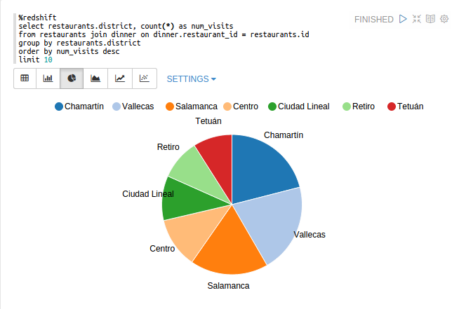



  <!-- Nav tabs -->
  <ul class="nav nav-tabs" role="tablist">
    <li role="presentation" class="active"><a href="#notebook" aria-controls="notebook" role="tab" data-toggle="tab">Notebook</a></li>
    <li role="presentation"><a href="#infrastructure" aria-controls="infrastructure" role="tab" data-toggle="tab">Infrastructure</a></li>
    <li role="presentation"><a href="#language" aria-controls="language" role="tab" data-toggle="tab">Language</a></li>
    <li role="presentation"><a href="#versions" aria-controls="versions" role="tab" data-toggle="tab">Versions</a></li>
    <li role="presentation"><a href="#visualization" aria-controls="visualization" role="tab" data-toggle="tab">Visualization</a></li>
  </ul>

  <!-- Tab panes -->
  

    

      

        <h2>Multi-purpose Notebook</h2>

        

          The Notebook is the place for all your needs
        

        <ul style="list-style-type: none;padding-left:10px;" >
          <li style="font-size:20px; margin: 5px;"> Data Ingestion</li>
          <li style="font-size:20px; margin: 5px;"> Data Discovery</li>
          <li style="font-size:20px; margin: 5px;"> Data Analytics</li>
          <li style="font-size:20px; margin: 5px;"> Data Visualization & Collaboration</li>
        </ul>
      

       
         

      

    

    

      

        <h2>Infrastructure</h2>

        

          Provide infrastructure was never easier
        

        <ul style="list-style-type: none;padding-left:10px;" >
          <li style="font-size:20px; margin: 5px;"> Apache Spark</li>
          <li style="font-size:20px; margin: 5px;"> Apache Hadoop</li>
          <li style="font-size:20px; margin: 5px;"> AWS Redshift</li>
        </ul>
      

       
      

    

    

      

        <h2>Connectors</h2>

        

          Many connectors is available
        

        <ul style="list-style-type: none;padding-left:10px;" >
          <li style="font-size:20px; margin: 5px;"> Apache Spark</li>
          <li style="font-size:20px; margin: 5px;"> Apache Hive</li>
          <li style="font-size:20px; margin: 5px;"> Redshift</li>
          <li style="font-size:20px; margin: 5px;"> Luigi</li>
        </ul>
      

      

         
        <ul style="list-style-type: none;padding-left:10px;" >
          <li style="font-size:20px; margin: 5px;"> Scala</li>
          <li style="font-size:20px; margin: 5px;"> Angular</li>
          <li style="font-size:20px; margin: 5px;"> Shell</li>
          <li style="font-size:20px; margin: 5px;"> Comming more</li>

        </ul>
      

    
    

    

      

        <h2>Control versions</h2>

        DataSwarm provides version control using gist. You can keep adding reviews and switch between they.

      

       
      

    

    

       
      <h2>Data visualization</h2>

      Some basic charts are already included in DataSwarm. Visualizations are not limited to SparkSQL's query, any output from any language backend can be recognized and visualized.

      

        

          
        

        

          
        

      

      <h3>Pivot chart</h3>

      With simple drag and drop DataSwarm aggeregates the values and display them in pivot chart. You can easily create chart with multiple aggregated values including sum, count, average, min, max.

      

        

          
        

      

    

  

